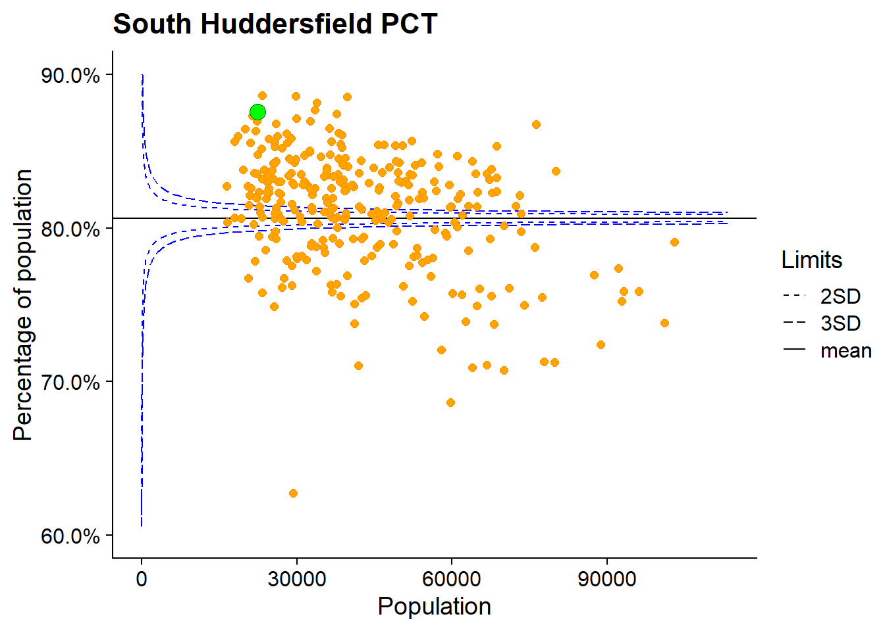
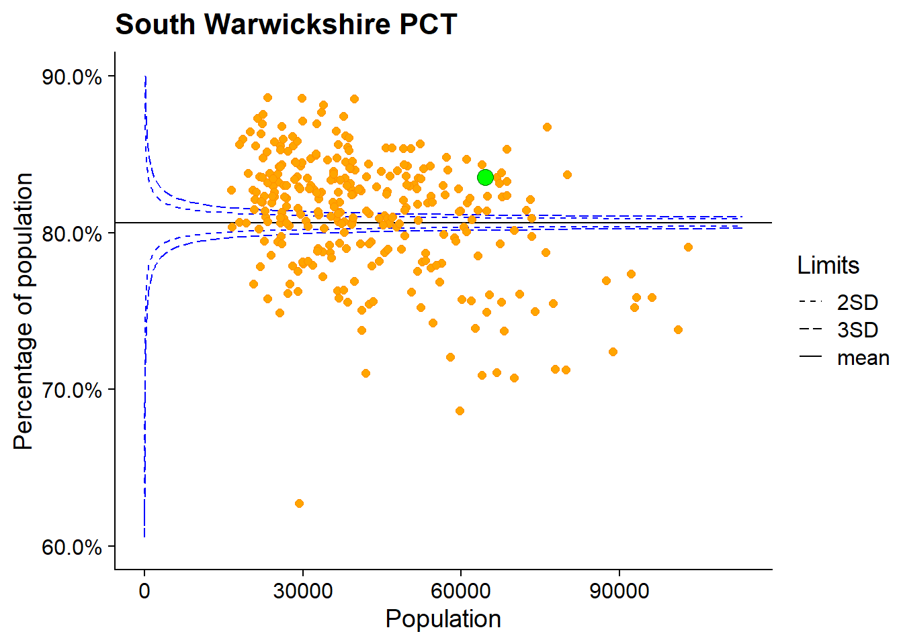
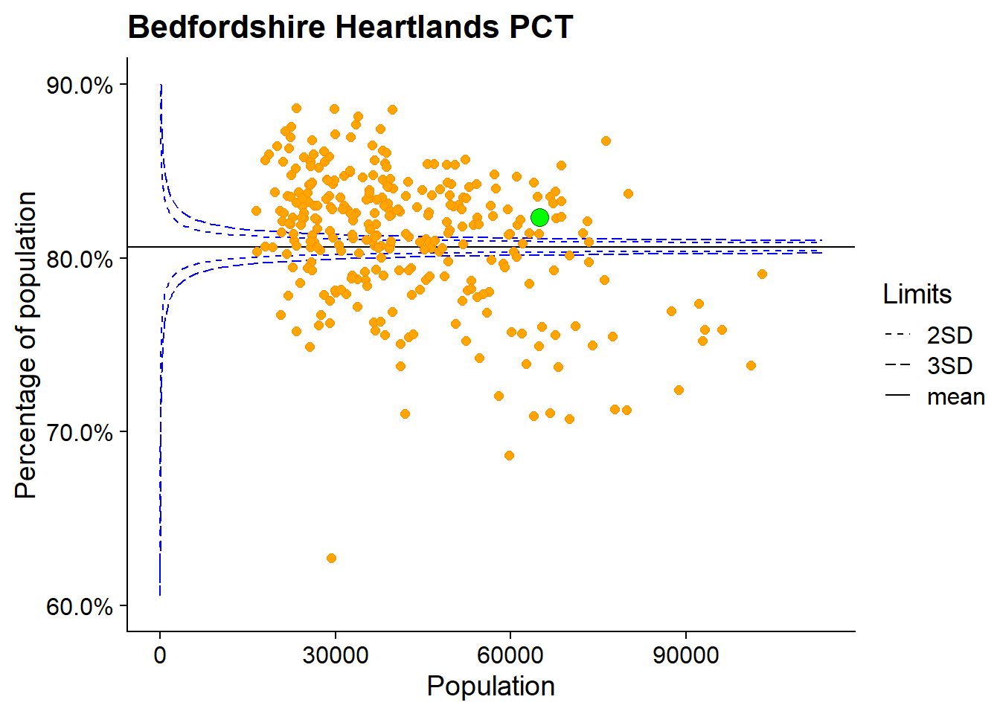
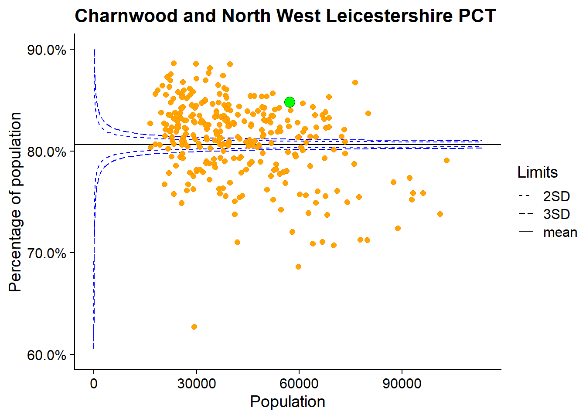
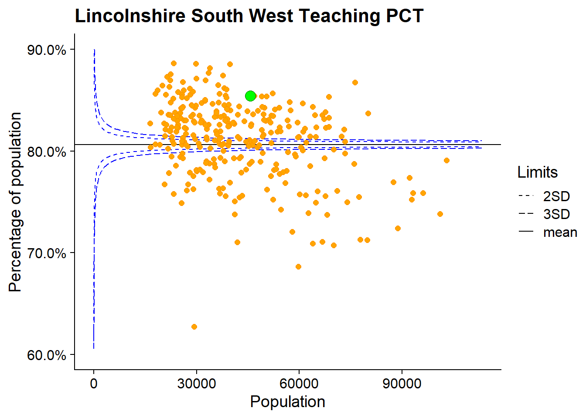

## Example funnel plot


```r
sample_data <- read_tsv("sample_data.txt")
```

```
## Parsed with column specification:
## cols(
##   pct = col_character(),
##   numerator = col_number(),
##   denominator = col_number()
## )
```

```r
knitr::kable(head(sample_data))
```


pct                          numerator   denominator
--------------------------  ----------  ------------
New Forest PCT                   35078         41980
Norwich PCT                      24804         31824
South Gloucestershire PCT        50051         61921
Havering PCT                     48686         59804
Kingston PCT                     35796         45449
Bromley PCT                      66970         80002

```r
sample_pcts <- sample(sample_data$pct, 6)

walk(
  sample_pcts,
  ~print(
    make_funnel_phe(
      sample_data,
      numerator = numerator,
      denominator = denominator,
      highlighted = pct == .x
    ) +
      ggtitle(.x)
  )
)
```


